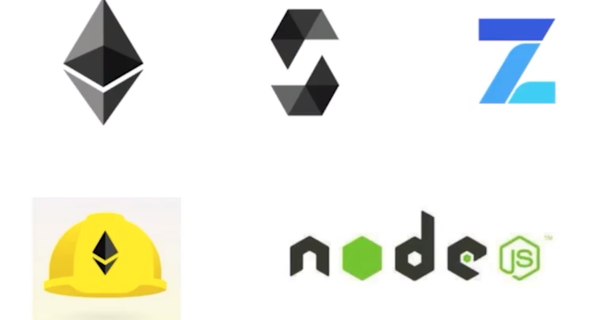

*Second project attempt, carried out step by step, using what was learned in the workshops and taking it to the next level for Chainlink Fall 2021 Hackathon.*
_Team: [Pinajmr](https://www.linkedin.com/in/pinajmr/) Dev and [Sarap](https://www.linkedin.com/in/sarahrappeneau/) UI & UX. Feel free to make a contribution or correction, beginner project._

#  to new world - NFT Collectible

#### When the developments of taking the rover to Mars had been a challenge, they did not imagine who were the first 2048 Humas in this crew, they all have completely random aspects and attributes using Oracles, be part of this new adventure.

##### [Link to frontend repository](https://github.com/pinajmr/NFT-Collectible-Humans-Interface)
##### [Link to site (soon)](https://)

#### Technology used

### How it works
* Blockchain uses the [Polygon ](https://polygon.technology/) and each user account is linked to a Ether account.
* Can you login with external provider like Metamask.
* Enter the website (Working on)

### Contract address
Our deployed contract on the Mumbai Polygon Testnet can be found the last beta version [here](https://mumbai.polygonscan.com/address/0x7f553120e739880A10F153A01bC78d0eEC09693F).

### Donations

* <strong>ETH: </strong>0x4317c44fD3143D8AC5723865CF046238A2cd8FD3

